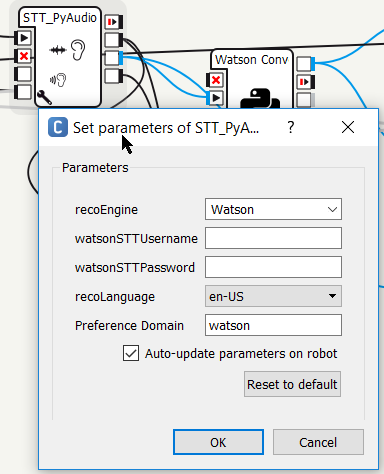

# This Choregraphe projects shows how to use Watson Speech-To-Text and Conversation APIs
Copyright 2017 IBM All Rights Reserved.
## How to use
You will need to set-up your Watson STT and Conversation API username and key.

The Watson STT_PyAudio python box is setup to get the Watson STT API key from either
  * the box parameters:  
  
  * or from the ALPreferenceManager preferences' ```watson``` domain, that you can setup either through python code or from the robot shell using ```qicli``` command:
```
qicli call ALPreferenceManager.setValue 'watson' 'watsonSTTUsername' '125604b9-9876-ab12-1234-6bd0f53430e7'
qicli call ALPreferenceManager.setValue 'watson' 'watsonSTTPassword' 'rrVMTw0NcvLH'
```
Similarly, the Watson Conversation box is setup to get the Watson Conversation userid, password and workspace ID from either 
   * the box parameters: 
   * or the ALPreferenceManager preferences' ```watson``` domain
```
qicli call ALPreferenceManager.setValue 'watson' 'watsonConversationWorkspaceId' 'fe657ac7-1615-4d08-8bb1-2ad0d0b88b2a'
qicli call ALPreferenceManager.setValue 'watson' 'WatsonConversationUsername' '125604b9-9876-ab12-1234-6bd0f53430e7'
qicli call ALPreferenceManager.setValue 'watson' 'watsonConversationPassword' 'rrVMTw0NcvLH'
```

## Operating principles
The code uses the ```PyAudio``` (https://pypi.python.org/pypi/PyAudio) and ```speech_recognition``` (https://pypi.python.org/pypi/SpeechRecognition/) python packages to acquire audio clips with blank detection, and invoque the Speech-To-Text API. Note that PyAudio has had to be recomplied for Pepper's 32 bit linux OS using the NaoVM virtual manchine provided by Aldebaran.

The ```speech_recognition``` API has bindings for various STT engines, and it is used to call Watson STT to transcribe audio to text.
This text output is then sent to Watson Conversation using a direct invocation of the Conversation REST API. 

## Tablet UI
The Pepper behavior displays a very simple Tablet UI that shows the transcribed text Question as returned from the Watson STT API, and the Answer from the Watson Conversation API.

This uses ```ALMemory``` keys to communicate with the main Choregraphe code.
